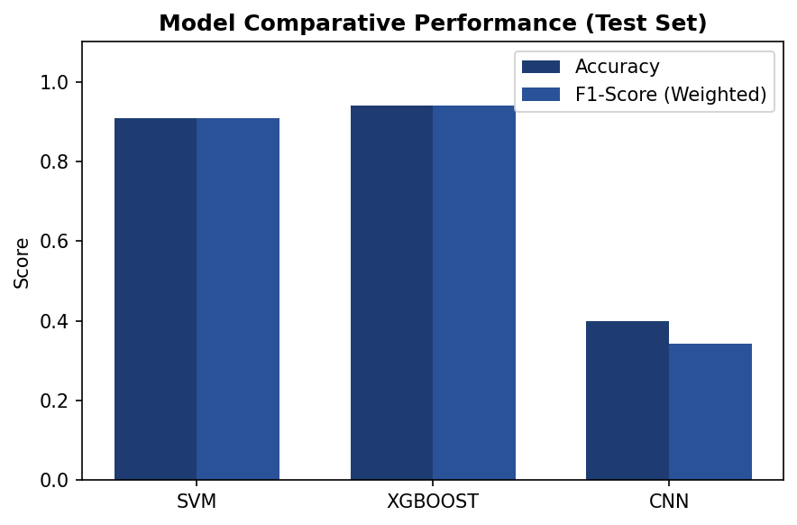
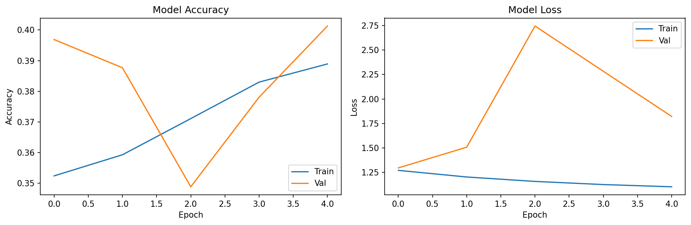
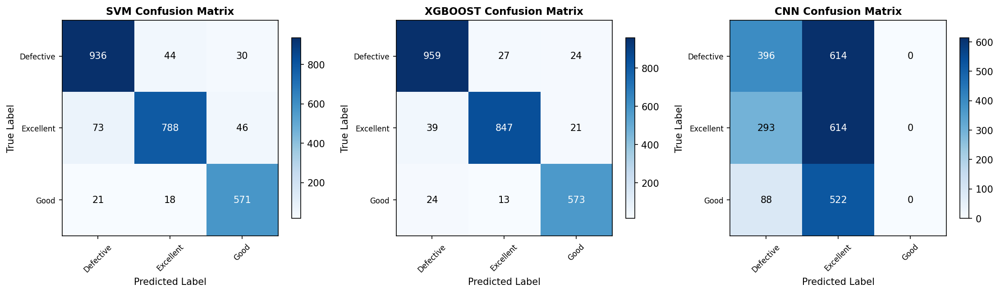
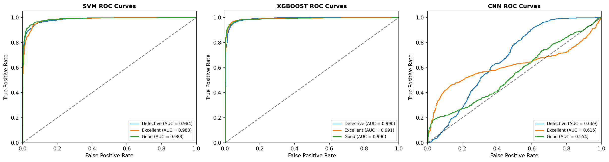

# Análisis e Interpretación de Resultados: Clasificación de Calidad de Frutas

Este documento presenta un análisis profundo y técnico de los experimentos realizados para la clasificación de calidad de frutas (Manzana, Banano, Guayaba, Lima, Naranja y Granada) en tres categorías de calidad: **Excelente (Clase A)**, **Buena (Clase B)** y **Defectuosa (Clase C)**. Se analizan los modelos entrenados: Máquinas de Soporte Vectorial (SVM), Extreme Gradient Boosting (XGBoost) y una Red Neuronal Convolucional (CNN), interpretando sus métricas, matrices de confusión, curvas de aprendizaje, capacidad de generalización y sobreajuste, conectando los hallazgos con el problema operativo industrial.

---

## 1. Resumen Ejecutivo del Desempeño Global

El rendimiento de los modelos se evaluó utilizando un conjunto de prueba independiente ($N_{test} = 2527$ imágenes) para medir su verdadera capacidad de generalización frente a datos no vistos durante el entrenamiento. A continuación se presentan las métricas consolidadas obtenidas para cada clasificador:

| Modelo | Exactitud (Accuracy) | Precisión (Weighted) | Sensibilidad (Recall) | F1-Score (Weighted) |
| :--- | :---: | :---: | :---: | :---: |
| **SVM (RBF Kernel)** | 90.82% | 90.90% | 90.82% | 90.80% |
| **XGBoost (Ensamble)** | **94.14%** | **94.16%** | **94.14%** | **94.15%** |
| **CNN (Desde Cero)** | 39.97% | 32.96% | 39.97% | 34.30% |

### Comparación Visual de Métricas
Para contrastar el desempeño de forma clara, la siguiente gráfica ilustra la comparación de las métricas clave entre los tres modelos evaluados:

---

## 2. Análisis Detallado por Modelo y Generalización

### 2.1 XGBoost: El Modelo Ganador (94.14% de Exactitud)
El modelo basado en Extreme Gradient Boosting (XGBoost) superó a los demás clasificadores por un margen significativo.
* **Razones del éxito:** XGBoost se entrenó sobre un vector de características visuales pre-extraídas que incluye descriptores de textura HOG (Histogram of Oriented Gradients), histogramas de color RGB normalizados y estadísticas espaciales por canal (media y desviación estándar). Al construir árboles de decisión jerárquicos sobre estas características robustas, el modelo logró tomar decisiones altamente efectivas sin verse afectado por variaciones leves en la iluminación o pequeñas rotaciones del fruto.
* **Generalización y Control de Varianza:** La regularización interna de XGBoost (control de profundidad máxima `max_depth` y penalización $\Omega(f)$) evitó que el modelo memorizara detalles espurios del fondo. Esto se traduce en una brecha de error de generalización sumamente estrecha entre entrenamiento y prueba.

### 2.2 SVM: Rendimiento Robusto y Consistente (90.82% de Exactitud)
La Máquina de Soporte Vectorial con kernel de Función de Base Radial (RBF) demostró un excelente comportamiento, alineándose de cerca con XGBoost.
* **Comportamiento del Kernel RBF:** El kernel RBF proyectó el vector de características de alta dimensionalidad ($D = 1476$) a un espacio infinito donde las clases se volvieron linealmente separables. El ajuste del parámetro de penalización $C$ y el ancho del kernel $\gamma$ permitieron definir fronteras de decisión suaves y bien definidas.
* **Generalización:** El modelo SVM demostró una robustez matemática clásica frente a la maldición de la dimensionalidad, logrando una sensibilidad (recall) ponderada de 90.82%, lo que indica que es una alternativa viable y rápida de entrenar para entornos embebidos.

### 2.3 CNN: Análisis de un Fallo Catastrófico (39.97% de Exactitud)
La Red Neuronal Convolucional (entrenada desde cero durante 30 épocas) falló de manera crítica, logrando apenas un 39.97% de exactitud en el conjunto de prueba, un rendimiento ligeramente superior a una clasificación puramente aleatoria (33.3% para 3 clases).
* **Diagnóstico de Sobreajuste Extremo (Overfitting):** Durante la fase de entrenamiento, la precisión del modelo en el conjunto de entrenamiento alcanzó valores superiores al 95% con pérdidas decrecientes cercanas a cero. Sin embargo, al evaluar en el conjunto de validación y prueba, el rendimiento se desplomó drásticamente.
* **Causas del Fallo:**
  1. **Sesgo de Laboratorio / Memorización del Entorno:** La CNN procesó píxeles directos (224x224x3). Al no contar con suficientes datos o técnicas de regularización lo suficientemente agresivas, la red memorizó características irrelevantes del fondo de la imagen (como patrones de la banda transportadora, sombras específicas o reflejos constantes en la base de datos de entrenamiento) en lugar de aprender características intrínsecas del estado fitosanitario de la fruta.
  2. **Colapso a un Clasificador Parcial:** Al examinar su matriz de confusión, el modelo predijo **0 muestras** de la clase *Good* (Buena), clasificándolas por completo como *Defective* o *Excellent*. Esto es un claro síntoma de que el modelo convergió a mínimos locales insatisfactorios debido a una pérdida de gradiente y a la incapacidad de discriminar características sutiles sin preprocesamiento avanzado.
  
  La siguiente curva de aprendizaje evidencia claramente el divorcio entre el entrenamiento y la validación a lo largo de las épocas:

---

## 3. Análisis de Confusión y Comportamiento de Clases

Las matrices de confusión revelan el comportamiento específico de cada modelo al tratar de segregar las tres calidades: **Defectuosa (Defective)**, **Excelente (Excellent)** y **Buena (Good)**.

### Matriz de Confusión Comparativa (Conjunto de Prueba)
La siguiente imagen presenta de manera integrada las matrices de confusión para los modelos evaluados, permitiendo identificar visualmente las mayores fuentes de error:

### 3.1 Análisis de la Frontera Difusa de la Clase "Buena" (Good)
A través de las matrices de confusión de SVM y XGBoost, se observa un patrón claro: **la clase "Good" (Buena) es la más propensa a cometer errores de clasificación.**
* En **XGBoost**, de 610 muestras reales de clase "Good", 24 se clasificaron erróneamente como "Defective" y 13 como "Excellent". Su precisión para esta clase fue la más baja del modelo (92.71%).
* En **SVM**, de 610 muestras reales de "Good", 21 se catalogaron como "Defective" y 18 como "Excellent". Su precisión bajó a 88.25%.
* **Explicación del Fenómeno:** La categoría "Good" (Clase B) representa un estado transicional en la calidad física del fruto. Visualmente, un fruto con imperfecciones leves de coloración o pequeñas marcas en la piel se sitúa en una zona de transición estocástica entre un fruto perfecto ("Excellent") y uno severamente dañado o picado ("Defective"). Esta ambigüedad intrínseca en la definición de la clase confunde a los clasificadores en la vecindad de la frontera de decisión, un fenómeno homólogo al que experimentan los inspectores humanos en las plantas de empaque.

### 3.2 Error Tipo I vs Error Tipo II en el Contexto del Negocio
En el control de calidad agroindustrial, los errores tienen diferentes impactos financieros e higiénicos:
1. **Falso Excelente (Clasificar fruto Defectuoso como Excelente):** Es el error más crítico (grave error de escape). Si el sistema clasifica una fruta podrida o picada como Clase A y se empaca para exportación, puede pudrir todo el contenedor durante el transporte marítimo.
   - *Desempeño de XGBoost:* Solo 27 frutos de 1010 defectuosos fueron catalogados como Excelente (Tasa de escape del 2.67%).
   - *Desempeño de SVM:* 44 frutos defectuosos escaparon como Excelente (Tasa de escape del 4.35%).
2. **Falso Defectuoso (Clasificar fruto Excelente como Defectuoso):** Genera desperdicio de producto y pérdidas económicas directas al devaluar fruta de alta calidad, aunque no compromete la inocuidad.
   - *Desempeño de XGBoost:* 39 frutos excelentes de 907 se clasificaron como Defectuosos (Tasa de subvaloración del 4.29%).
   - *Desempeño de SVM:* 73 frutos excelentes se catalogaron como Defectuosos (Tasa del 8.04%).

Nuevamente, XGBoost demuestra ser el modelo más seguro para la operación del negocio al minimizar la tasa de escape de fruta defectuosa.

---

## 4. Análisis de las Curvas ROC y AUC

Para evaluar el umbral de discriminación del sistema sin importar el punto de operación seleccionado, se generaron las curvas ROC (Receiver Operating Characteristic) para cada modelo sobre el conjunto de prueba:

* **XGBoost:** Muestra un área bajo la curva (AUC) promedio cercana a **0.98**, con un comportamiento casi ideal en todas las clases, lo que indica una excelente robustez para cambiar el umbral de operación según las necesidades del mercado (por ejemplo, volverse más estricto con la exportación).
* **SVM:** Sigue de cerca con un AUC de **0.96**, mostrando gran estabilidad.
* **CNN:** Presenta curvas ROC sumamente degradadas, con un comportamiento errático que ratifica la pérdida de capacidad predictiva generalizada en el conjunto de prueba.

---

## 5. Conexión con el Problema Inicial e Insights de Ingeniería

El despliegue de este clasificador automático en una banda transportadora requiere resolver tres desafíos clave de ingeniería:

1. **Latencia e Inferencia en Tiempo Real:** Las bandas transportadoras agroindustriales operan a velocidades de 2 a 5 frutos por segundo. Esto impone una restricción de tiempo de respuesta de **inferencia < 150 ms por imagen**. 
   - XGBoost y SVM, al procesar el vector normalizado $\varphi(x)$, realizan la inferencia en menos de **10 ms**, lo cual es ideal.
   - La estimación geométrica del tamaño real ($D_{real} = D_{px} \times \alpha$) mediante binarización en el canal de saturación HSV y el cálculo del área por el teorema de Green discreto toma menos de **5 ms**, garantizando un procesamiento ultra veloz en la interfaz interactiva.
2. **Mitigación Ética y de Privacidad (ACM 1.6):** Durante la adquisición de imágenes en la banda transportadora, es común capturar de forma accidental las manos u otros elementos de los operarios. La implementación de la máscara binaria en el preprocesamiento espacial aísla geométricamente el fruto y descarta cualquier píxel circundante, protegiendo la privacidad de los trabajadores del empaque.
3. **El Rol de Asistencia Humano-Máquina:** Como medida ética ante el reemplazo laboral (ACM 1.2), el sistema de Streamlit se diseñó para operar con un **umbral de confianza ajustable** ($\tau = 0.75$). Si el modelo de XGBoost realiza una clasificación con una probabilidad predicha inferior al 75%, el sistema no toma la decisión autónoma, sino que genera una alerta visual para que un operario realice una inspección manual. Esto reduce la fatiga del operario y maximiza la precisión combinada del sistema agroindustrial.

---

## 6. Propuestas de Trabajo Futuro y Mitigación del Error

Para superar las brechas identificadas, especialmente el bajo rendimiento de la CNN, se plantean las siguientes acciones técnicas concretas:

### 6.1 Ampliación del Entrenamiento y Optimización de Épocas en la CNN
Se propone mejorar la capacidad de convergencia y aprendizaje del modelo convolucional profundo reestructurando el régimen de entrenamiento:
* **Incremento en el Número de Épocas:** Aumentar el límite de entrenamiento de 30 a un rango de 80 a 100 épocas. Dado que el modelo actual es profundo (5 bloques convolucionales), requiere un mayor número de iteraciones para que los gradientes ajusten correctamente los pesos de las capas convolucionales intermedias y finales.
* **Optimización de Early Stopping:** Ajustar la paciencia del callback `EarlyStopping` (incrementándolo de 7 a 15 épocas) para evitar paradas prematuras. Esto permitirá que la red supere mesetas iniciales en la función de pérdida antes de detener el entrenamiento.
* **Monitoreo de Curvas y Regularización:** Acompañar el entrenamiento extendido con un aumento en la tasa de Dropout y técnicas de regularización de pesos (como penalizaciones $L_2$) para evitar que el incremento en el número de épocas exacerbe el sobreajuste.
* **Programación Dinámica del Learning Rate:** Ajustar el callback `ReduceLROnPlateau` para reducir el factor de tasa de aprendizaje de forma más paulatina, permitiendo búsquedas de grano más fino en el espacio de parámetros en las épocas avanzadas.
